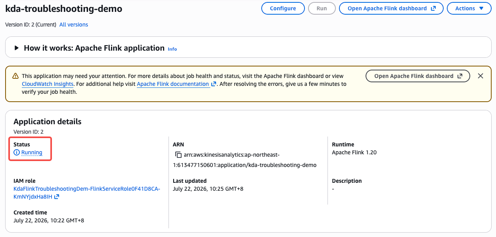
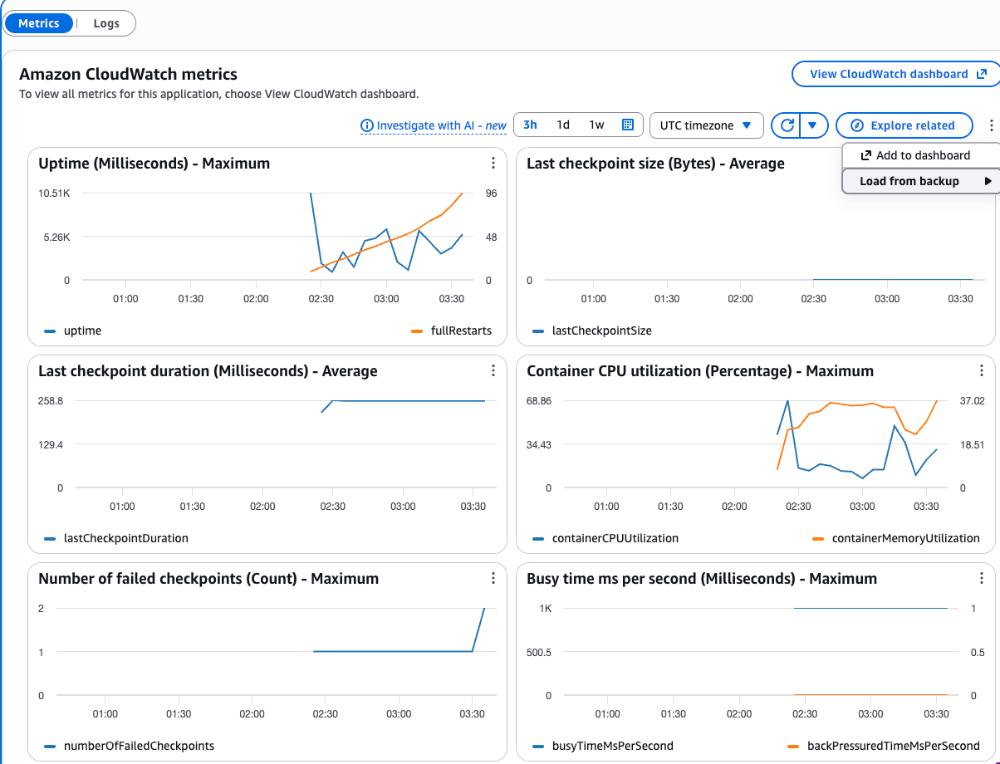
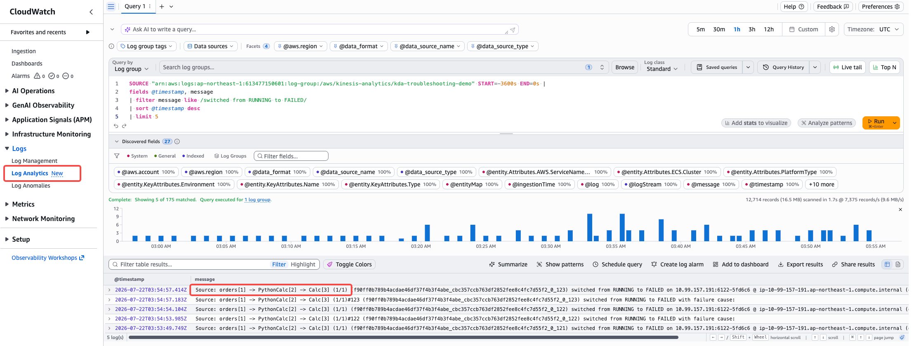
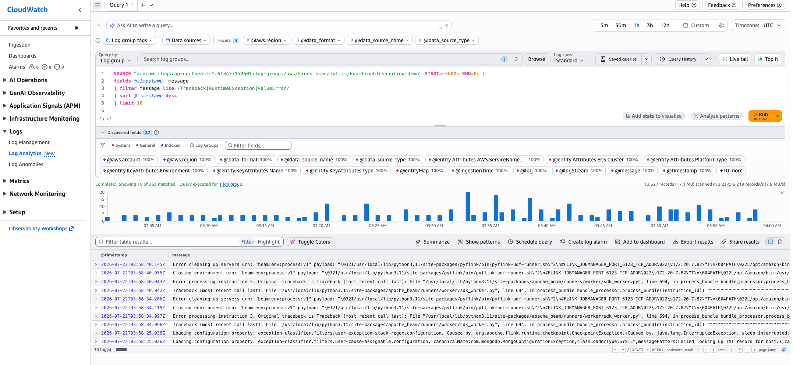
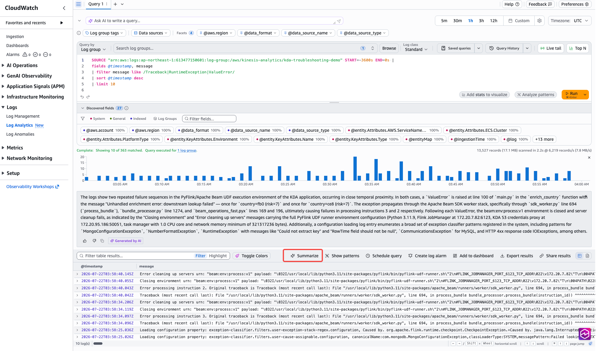
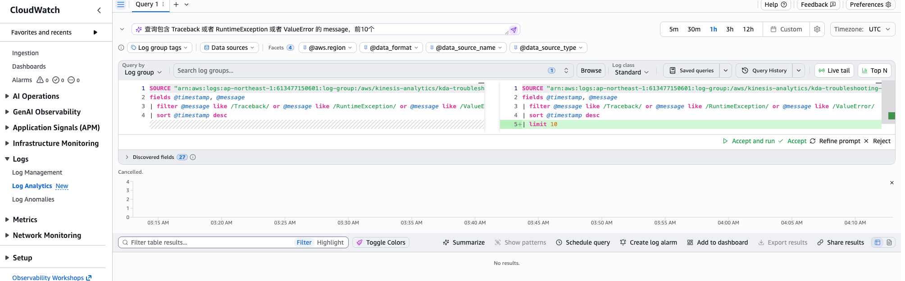
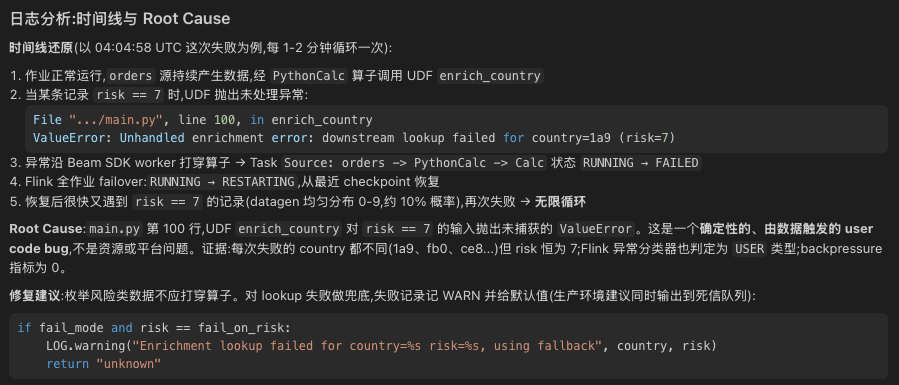
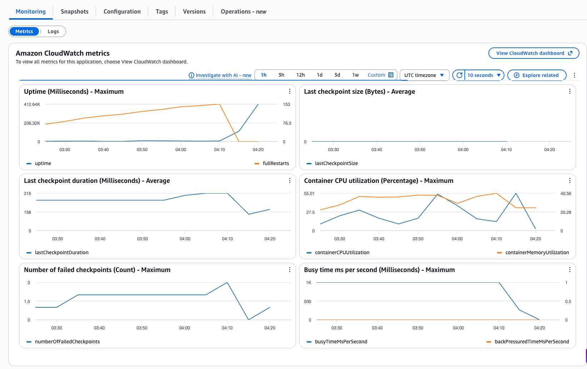

# Console Demo 操作手册 — 重启风暴排查（客户视角）

> 场景设定：客户说 **"我们的 Flink 作业数据断断续续，下游一直在抱怨延迟，不知道哪里出了问题。"**
> 你扮演 SA，带客户在 AWS Console 上从症状走到根因，再走完修复闭环。
>
> 本手册基于真实部署验证过一遍（region：东京 ap-northeast-1，应用名 `kda-troubleshooting-demo`）。
> 全程约 25 分钟。截图放在 `images/` 目录，文件名见各步骤。

---

## 第 0 步：部署与启动（演示前 15 分钟准备）

```bash
cd 04-demo/cdk
npm install
AWS_REGION=ap-northeast-1 npx cdk deploy --require-approval never
# 部署约 1-2 分钟，输出 ApplicationName / LogGroupName / StartCommand

# 启动应用（部署完是 READY，不启动没有日志）
AWS_REGION=ap-northeast-1 aws kinesisanalyticsv2 start-application \
  --application-name kda-troubleshooting-demo \
  --run-configuration '{"FlinkRunConfiguration":{"AllowNonRestoredState":true}}'

# 轮询状态：STARTING 约 2-3 分钟后变 RUNNING
AWS_REGION=ap-northeast-1 aws kinesisanalyticsv2 describe-application \
  --application-name kda-troubleshooting-demo \
  --query 'ApplicationDetail.ApplicationStatus' --output text
```

RUNNING 之后再等 **2-3 分钟**，UDF 异常触发，进入重启循环。演示开始前用一条 Insights 查询确认"病症"已出现（见第 3 步查询 ①，有结果即可开讲）。

> 计费提醒：应用运行按 KPU 计费（本栈 1 KPU）。演示完务必走第 6 步清理。

---

## 第 1 步：从"症状"进 Console（2 分钟）

**客户台词**："作业数据断断续续，延迟很大。"

**你的动作**：打开 Managed Flink 应用列表页：

> https://ap-northeast-1.console.aws.amazon.com/flink/home?region=ap-northeast-1#/applications



**讲解点（对客户说）**：

- 列表里 `kda-troubleshooting-demo` 状态显示 **Running**——这是重启类问题最迷惑人的地方。
- 状态是粗粒度的：应用在 `RUNNING → RESTARTING → RUNNING` 之间反复横跳，列表页看不出来。
- 所以第一步永远不是翻日志，而是点进应用看指标，**先把问题的时间窗定下来**。

---

## 第 2 步：Monitoring 页定位时间窗（5 分钟）

点应用名进入详情页 → **Monitoring** 标签 → 子标签停在 **Metrics** → 右上角时间范围选 **3h**、时区选 **UTC**。



对着四张图讲（按信息量排序）：

| 图 | 看什么 | 讲解点 |
|---|---|---|
| **Uptime (Milliseconds)** 左上角 | 橙色线 `fullRestarts`（右侧 Y 轴） | 正常应用是 0 的横线；现在一路爬楼梯（实测半小时爬到 96+）。重启风暴实锤。 |
| 同一张图 | 蓝色线 `uptime` 锯齿状 | 每次涨一点就掉回 0——作业每次活不过一两分钟。比任何指标都直观："你的作业最长只活了 10 秒"。 |
| **Number of failed checkpoints** 左下角 | 计数爬升 | 作业存活时间太短，checkpoint 来不及完成。 |
| **Busy time ms per second** 右下角 | 橙色 `backPressuredTimeMsPerSecond` = 0 | **排除项**：不是反压/资源问题，方向指向异常导致的失败。 |

> 备注：`downtime`、`numRecordsInPerSecond` 等全量指标不在这个精选页上，
> 需要点右上角 **View CloudWatch dashboard**。演示时 Uptime 一张图信息量已经够了。

**给客户的一句话小结**：
"状态显示 Running，但 fullRestarts 96 次、uptime 锯齿、checkpoint 失败——作业在反复重启，
时间窗从 XX:XX (UTC) 开始，每 1-2 分钟一次。现在去日志找它为什么死。"

---

## 第 3 步：Logs Insights 找根因（8 分钟）

打开 CloudWatch Logs Insights：

> https://ap-northeast-1.console.aws.amazon.com/cloudwatch/home?region=ap-northeast-1#logsV2:logs-insights

1. Log group 选 `/aws/kinesis-analytics/kda-troubleshooting-demo`
2. 时间范围选 **1h**

### 查询 ①：确认重启在发生（谁死了）

```
fields @timestamp, message
| filter message like /switched from RUNNING to FAILED/
| sort @timestamp desc
| limit 5
```



**期望结果**（实测）：

```
Source: orders[1] -> PythonCalc[2] -> Calc[3] (1/1) ... switched from RUNNING to FAILED with failure cause:
```

**讲解点**：任务名里的 **PythonCalc** 说明凶手在 Python UDF 里，一条日志就把范围从"整个作业"缩小到"某个算子"。

### 查询 ②：抓完整异常栈（为什么死）

```
fields @timestamp, message
| filter message like /Traceback|ValueError|RuntimeException/
| sort @timestamp desc
| limit 10
```



**期望结果**：Python Traceback，最底部是根因：

```
ValueError: Unhandled enrichment error: downstream lookup failed for country=XXX (risk=7)
```

### 查询 ③（可选加餐）：错误随时间分布，和指标图对齐

```
fields @timestamp
| filter message like /switched from RUNNING to FAILED/
| stats count(*) as failures by bin(5m)
| sort by bin(5m)
```

**讲解点**：失败次数的时间分布和第 2 步 fullRestarts 的爬升曲线完全吻合——**指标定时间窗、日志找根因**，两条证据链闭环。

> Flink 平台侧还有个彩蛋：查询①的结果附近能看到
> `Exception type is USER from filter results [UserFunctionExceptionFilter ...]`
> ——Managed Flink 自己已经把异常分类为 **USER 代码问题**（而非平台问题），
> 这句可以帮客户快速排除"是不是 AWS 的锅"。

### 加餐：CloudWatch 原生 AI Summarize（2 分钟）

在查询②的结果页选中日志（或用结果页的 AI 总结入口），让 CloudWatch 直接生成摘要：



**实测输出要点**（东京环境验证）：

- 准确抓到根因位置：`ValueError` at `main.py` line 100, `enrich_country`，消息 "Unhandled enrichment error: downstream lookup failed"
- **自己发现了失败模式的共性**：两次失败 country 不同（fb0 / ce8）但 **都是 risk=7**——这正是定位条件性 bug 的关键线索
- 连异常在 Beam SDK worker 里的传播路径都理出来了（`sdk_worker.py` → `bundle_processor.py` → `beam_operations_fast.pyx`）

**讲解点（和第 4 步 Kiro 形成对比）**：

- 优点：不离开 console、零配置、几秒出摘要，适合值班时快速收集证据。
- 局限：只回答"发生了什么"，不回答"为什么"和"怎么修"；重点会被平台噪音
  （比如 exception classifier 配置枚举）冲淡，也不会主动建议"对 risk==7 做兜底"。
- 结论：**Summarize 管证据，Kiro 管结论和修复**——两步递进，正好引出第 4 步。

### 加餐：自然语言生成查询（Query Generator，2 分钟）

不会写 Insights 查询语法？在查询编辑框上方点 **Query generator**，用自然语言描述需求，
让它生成查询。比如输入：

```
show me logs where a task switched from RUNNING to FAILED in the last hour
```



**讲解点**：

- 对不熟悉 Insights 语法的客户，这是零门槛入口——描述症状就能拿到能跑的查询。
- 生成后可以人工微调（改时间窗、加 limit），比从零写快得多。
- 和 Summarize 组合就是 console 内的完整 AI 工作流：**自然语言生成查询 → 跑出结果 → AI 总结**，
  全程不需要记任何语法。本手册第 3 步的查询①②③照样保留，作为"标准答案"对照。

---

## 第 4 步：AI 读栈定根因（5 分钟，Kiro 环节）

把查询②的结果导出（Export results → CSV/JSON，或直接复制），喂给 Kiro：

```
#File <导出的日志文件>
这是 Managed Flink 的 CloudWatch 日志，请还原时间线，给出 root cause 和修复建议。
```



**期望结论**（人肉对照答案）：

- 时间线：`RUNNING → 算子抛 ValueError → Task FAILED → 从 checkpoint 恢复 → RESTARTING → 循环`
- Root cause：UDF `enrich_country` 对 `risk == 7` 的行抛出未处理异常（`flink-app/main.py` 里故意埋的 bug）
- 修复建议：对异常行做兜底处理（try/except + 死信/默认值），而不是让异常打穿算子

**讲解点**：AI 的价值不是"会读日志"，是**快**——几百行栈信息 10 秒出结论，还能直接改代码。

---

## 第 5 步：修复闭环（5 分钟）

两种修法，演示选其一：

### 方式 A：改运行时属性（快，适合现场）

编辑 `cdk/lib/flink-demo-stack.ts`，把 `FlinkAppProperties` 里的 `fail_mode` 改成 `'false'`：

```ts
propertyMap: {
  fail_mode: 'false',   // ← 原来是 'true'
  ...
}
```

```bash
AWS_REGION=ap-northeast-1 npx cdk deploy --require-approval never
# 重启应用使属性生效
AWS_REGION=ap-northeast-1 aws kinesisanalyticsv2 stop-application \
  --application-name kda-troubleshooting-demo --force
# 等状态变 READY 后再 start（同第 0 步）
```

### 方式 B：真改代码（更有说服力，正好演示 Kiro 改代码）

让 Kiro 修 `cdk/flink-app/main.py` 的 UDF——对异常做兜底而不是抛出：

```python
if fail_mode and risk == fail_on_risk:
    LOG.warning("Enrichment lookup failed for country=%s risk=%s, using fallback", country, risk)
    return "unknown"
```

> **实测坑（重要）**：应用在重启循环中时**不能直接 `cdk deploy`**——CloudFormation 更新应用
> 前要打 snapshot，downtime 中打不出来，deploy 会失败，且栈会卡在 `UPDATE_ROLLBACK_FAILED`。
> 正确顺序：**先 force-stop → 等 READY → deploy → start**：

```bash
# 1) 强制停止（downtime 中必须 --force）
AWS_REGION=ap-northeast-1 aws kinesisanalyticsv2 stop-application \
  --application-name kda-troubleshooting-demo --force
# 等状态变 READY（约 1 分钟）

# 2) 部署新代码
AWS_REGION=ap-northeast-1 npx cdk deploy --require-approval never

# 3) 重新启动（同第 0 步 start 命令）
```

如果已经踩坑、栈卡在 `UPDATE_ROLLBACK_FAILED`：先 force-stop 应用等 READY，然后
`aws cloudformation continue-update-rollback --stack-name KdaFlinkTroubleshootingDemo`，
回滚完成后再按上面的顺序重来。

### 验证修复（Logs Insights 侧，实测数据）

启动后等 3-5 分钟，跑两条查询：

```
# 兜底日志在持续产生（实测 5 分钟 93 条）——risk=7 的数据还在来，但被吃掉了
fields @timestamp, message
| filter message like /using fallback/
| sort @timestamp desc | limit 5

# FAILED / ValueError 归零（实测 0 条）
fields @timestamp
| filter message like /switched from RUNNING to FAILED|ValueError/
| stats count(*) as failures
```

**给客户讲**：这两条查询就是"修复证明"——同样的坏数据还在流入，但作业不再死。

### 验证修复

回到 Monitoring 页（等 3-5 分钟）：



- `fullRestarts` 曲线走平（不再增长）
- `uptime` 变成一条持续上升的直线
- Logs Insights 里查询①不再有新结果

**给客户的收尾一句话**："从症状到修复 25 分钟：指标定位时间窗 2 分钟、日志定根因 5 分钟、AI 读栈 10 秒、改代码部署 5 分钟。这套流程沉淀成 runbook，下次值班同学照着走就行。"

---

## 第 6 步：清理（务必执行，避免持续计费）

```bash
# 1) 强制停止（重启循环中普通 stop 会因无法生成 snapshot 失败，必须 --force）
AWS_REGION=ap-northeast-1 aws kinesisanalyticsv2 stop-application \
  --application-name kda-troubleshooting-demo --force

# 2) 等状态变 READY（约 30-60 秒）
AWS_REGION=ap-northeast-1 aws kinesisanalyticsv2 describe-application \
  --application-name kda-troubleshooting-demo \
  --query 'ApplicationDetail.ApplicationStatus' --output text

# 3) 销毁栈
cd 04-demo/cdk
AWS_REGION=ap-northeast-1 npx cdk destroy --force
```

---

## 附：截图清单

| 文件名 | 内容 | 截图时机 |
|---|---|---|
| `images/01-app-list.png` | 应用列表页，状态 Running | 风暴发生后任意时间 |
| `images/02-monitoring-metrics.png` | Monitoring → Metrics，含 Uptime/fullRestarts 图 | 风暴 30 分钟后（fullRestarts 数字更震撼） |
| `images/03-insights-failed-task.png` | 查询①结果，含 PythonCalc FAILED 行 | 风暴期间 |
| `images/04-insights-traceback.png` | 查询②结果，含 ValueError 根因行 | 风暴期间 |
| `images/05-logs-summarize.png` | CloudWatch AI Summarize 的摘要输出 | 查询②做完顺手截 |
| `images/06-kiro-analysis.png` | Kiro 对日志的分析回答 | 第 4 步做完时 |
| `images/07-text-to-sql.png` | Query generator 自然语言生成查询 | 风暴期间，第 3 步顺手截 |
| `images/08-monitoring-healthy.png` | 修复后 Monitoring 页，fullRestarts 走平 | 修复后 5-10 分钟 |

## 附：常见翻车点

- **stop 报 "Failed to take snapshot ... downtime"**：重启循环中无法生成 snapshot，加 `--force`。
- **Logs Insights 没结果**：确认时间范围覆盖启动之后、时区选对（console 默认本地时区，日志是 UTC）。
- **fullRestarts 图找不到**：它叠在 "Uptime (Milliseconds)" 图里，橙色线、右侧 Y 轴，不是独立的图。
- **修复后 fullRestarts 没归零**：这是累计计数器，走平就是修好了，不会归零。
- **重启循环中直接 `cdk deploy` 失败、栈卡 `UPDATE_ROLLBACK_FAILED`**：CloudFormation 更新
  应用前要打 snapshot，downtime 中打不出来。先 force-stop 等 READY，
  `continue-update-rollback` 救回栈，再按 stop → deploy → start 的顺序重来（见第 5 步方式 B）。
